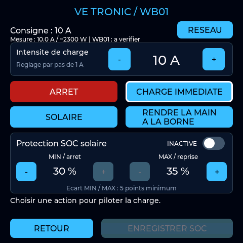

# 12KSG02LP1 / Vetronic V3 — 4.3.4-vetronic-v3

Variante dédiée au Deye 12K-SG02LP1 et à la borne VE TRONIC WB01 pilotée par
sa passerelle ESP32. Base : `12KSG02LP1_v3` 4.3.3 et client WB01 de
l’ancienne intégration WB01. Les versions précédentes restent dans l’historique Git.

## Fonctions

- Tableau de bord PV, réseau, consommation et batterie ; historique 24 h.
- Registres et coefficients SG02LP1, visibilité PV1/PV2/PV3, SmartLoad ou
  production GEN MO, cumul GEN + PV et énergie GEN journalière R62 ou estimation.
- Menus Deye/logger, tarifs/HC/Tempo, véhicule, relais, réseau/heure et affichage.
- Relais GPIO40, comparaison de registre, coefficient, seuil et temporisation.
- Veille horaire avec réveil tactile, thèmes sombre/clair et luminosité.
- Web : configuration, diagnostic, historique, export/import JSON, OTA et
  page `/vetronic` de pilotage de la borne.

Cette édition utilise toujours le profil SG02LP1, sans modifier le modèle
mémorisé pour la V3 générale. Les registres personnalisés SG02 et les réglages
V3 existants sont repris. Les espaces NVS restent communs avec cette base :
changer un réglage puis revenir à l'ancien firmware peut retrouver ce réglage.
Le profil garde les trois lignes PV historiques configurables ; masquer une
ligne ne commande pas l'entrée de l'onduleur.

## Relais : « Valeur signée »

Cette option interprète le registre comme un entier 16 bits pouvant être
négatif ou positif. Elle convient notamment aux puissances dont le signe
indique le sens charge/décharge ou import/export. Pour le SOC batterie,
laisser l'option désactivée et utiliser le coefficient 1 : une lecture de
80 correspond à 80 %. Pour inverser le signe d'une valeur, utiliser un
coefficient négatif ; l'option « Valeur signée » ne fait pas cette inversion.

## Mise en route

1. Configurer le Wi-Fi et le logger Deye dans les menus réseau et Deye.
2. Dans Véhicule électrique > Activation / Tarifs, activer VE TRONIC / WB01,
   enregistrer et laisser l'écran redémarrer.
3. Ouvrir Recharge VE TRONIC, puis Réseau pour régler l'IP de la passerelle.
   Valeur initiale : `192.168.1.130`, API HTTP sur le port 80.
4. La voiture du tableau de bord ouvre aussi les commandes.

Les écrans distinguent le courant mesuré, la puissance estimée à 230 V,
la consigne demandée et sa confirmation WB01. La puissance est précédée de
`~` : il ne s'agit pas d'une mesure de puissance active. Une consigne ne
prouve pas que le véhicule consomme cette puissance.

## Commandes de la borne

| Action | Comportement |
|---|---|
| Arrêt | Demande une consigne nulle via la passerelle. |
| Charge immédiate | Demande le courant choisi, de 6 à 32 A au maximum. |
| Solaire | Confie la régulation solaire à la passerelle ESP32. |
| Rendre la main à la borne | Libère la consigne forcée et laisse la WB01 gérer sa charge. |

**Rendre la main à la borne** annule toute reprise tarifaire mémorisée par
l'écran. Le pilotage reste disponible : une nouvelle action Arrêt, Manuel
ou Solaire permet de reprendre la main.

Le libellé est identique sur l'écran et sur le Web. La valeur `legacy` reste
uniquement un identifiant de compatibilité avec l'API existante : elle envoie
la libération `$SC -1`. L'action ne restaure pas d'anciens paramètres internes
de programmation de la WB01.

Le plafond manuel respecte `manualLimitA` annoncé par le firmware amélioré
de la passerelle, avec une limite locale de 32 A. Si ce champ n'existe pas,
le plafond configuré `limit` sert de repli. Le champ `nativeLimitA` utilisé
pour le solaire ne réduit pas à lui seul ce plafond manuel. La passerelle
valide la demande et peut la refuser.

Le réglage +/- reste un brouillon jusqu'à Charge immédiate. La protection SOC
solaire possède aussi son bouton Enregistrer SOC : activation, seuil MIN
d'arrêt et seuil MAX de reprise, écart minimum de cinq points. L'enregistrement
des seuils conserve le mode de charge actif. La route `/api/soc-guard` du
firmware de la passerelle est nécessaire.

## Tarifs optionnels

La restriction tarifaire est désactivée par défaut. Les horaires personnels
et l'affichage Tempo restent disponibles indépendamment de son activation.

Lorsqu'elle est activée, elle concerne **uniquement une charge manuelle
lancée et confirmée depuis cet écran ou sa page Web pendant ce démarrage** :

- Une nouvelle charge manuelle est refusée si les règles HC/HP l'interdisent.
- Une charge manuelle appartenant à l'écran est mise en pause par Arrêt
  lorsque les tarifs l'interdisent. À leur retour, l'écran peut reprendre
  la même intensité après une nouvelle lecture de la passerelle.
- Arrêt manuel, Solaire ou Rendre la main annulent la reprise automatique.
- Une modification externe détectable du mode ou de l'intensité annule
  également la reprise. Une autre action Arrêt sur la passerelle lorsqu'elle
  est déjà en Arrêt n'est pas distinguable par cette API : pour annuler une
  pause tarifaire, utiliser Arrêt ou Rendre la main sur l'écran ou son Web.
- Une réponse POST perdue ou un résultat incertain annule la reprise : aucun
  renvoi automatique de la commande.
- Le redémarrage ne reprend pas une charge et ne récupère pas une ancienne
  pause. Une charge déjà lancée par un autre appareil reste sous son contrôle.

Le Solaire et la charge autonome de la borne ne sont pas modifiés par les
tarifs de l'écran. Si l'heure ou la couleur nécessaire est inconnue, la
charge manuelle sous restriction n'est pas autorisée. Le contrôle dépend
de la liaison avec la passerelle ; ce n'est pas une coupure électrique autonome.
Pour Tempo, sélectionner le fuseau Europe/Paris.

## Communication et sauvegarde

Le client HTTP tourne dans une tâche FreeRTOS indépendante de LVGL. Lecture
toutes les trois secondes après la fin de la précédente ; une réponse de
plus de douze secondes, une perte Wi-Fi ou une mesure WB01 invalide affiche
une mesure indisponible. Les mesures Deye et borne restent indépendantes.

Une seule commande est acceptée à la fois. Elle expire après quinze secondes
d'attente. Le jeton CSRF, le mode, le courant et les tarifs sont vérifiés avant
envoi ; le résultat est relu. Aucun POST n'est renvoyé après une réponse perdue.
Le Web de l'écran applique aussi son authentification et son jeton CSRF.

L'adresse de la passerelle est incluse dans l'export JSON sous `vetronic_host`.
Un ancien export sans ce champ conserve l'adresse actuelle. Les réglages SOC
restent stockés par la passerelle, pas dans la sauvegarde de l'écran.

Aucune consigne de charge n'est envoyée au démarrage. Désactiver la page VE
arrête les lectures et masque les commandes ; cela n'arrête pas une charge.
Les anciennes écritures VE Deye LoRa sont bloquées, même avec d'anciennes
préférences autorisant ces écritures. Aucun bloc VE R489/R490 n'est interrogé
automatiquement. Les sondes expertes facultatives restent des lectures seules.

## Compilation

À la racine du dépôt GitHub, compiler avec :

```powershell
pio run -e vetronic_v3
```

Sources : `firmware/DEYE_VETRONIC_V3/`. Pour Arduino IDE, lancer
`PREPARER_ARDUINO.bat`, puis ouvrir `DEYE_VETRONIC_V3.ino` dans ce dossier.

Binaire applicatif : `.pio/build/vetronic_v3/firmware.bin` à la racine du dépôt.
Télécharger le binaire OTA ou le pack Windows dans la release
`v4.3.4-vetronic-v3`. Il s'agit du firmware de l'écran, pas de la passerelle.

Configuration ESP32-S3, écran 480 × 480, PSRAM OPI, USB CDC actif,
partition Minimal SPIFFS avec OTA, flash 4 MB comme les variantes existantes.

## Vérification

```powershell
./firmware/DEYE_VETRONIC_V3/tests/run_checks.ps1
node ./firmware/DEYE_VETRONIC_V3/tests/web_test.cjs
```

Tests des profils et migrations, horaires/tarifs/relais/veille/GEN, codec JSON,
protocole WB01, limites manuelles, SOC, pause/reprise et abandon après retour
à la borne, ainsi que rendus LVGL en sombre/clair, saisie réseau, boutons,
brouillons et états occupé/hors ligne.

Avant utilisation quotidienne, vérifier sur le matériel le courant avec la
page de la passerelle, une charge manuelle faible puis l'arrêt, le retour
à la borne, le solaire et la protection SOC. Comparer aussi les mesures
Deye et le compteur GEN au LCD. Ces tests logiciels ne remplacent pas
ces vérifications. La préparation WB01 et la calibration solaire restent
dans le firmware et la configuration de sa passerelle.

## Aperçu

Rendu des tests LVGL avec valeurs simulées.


